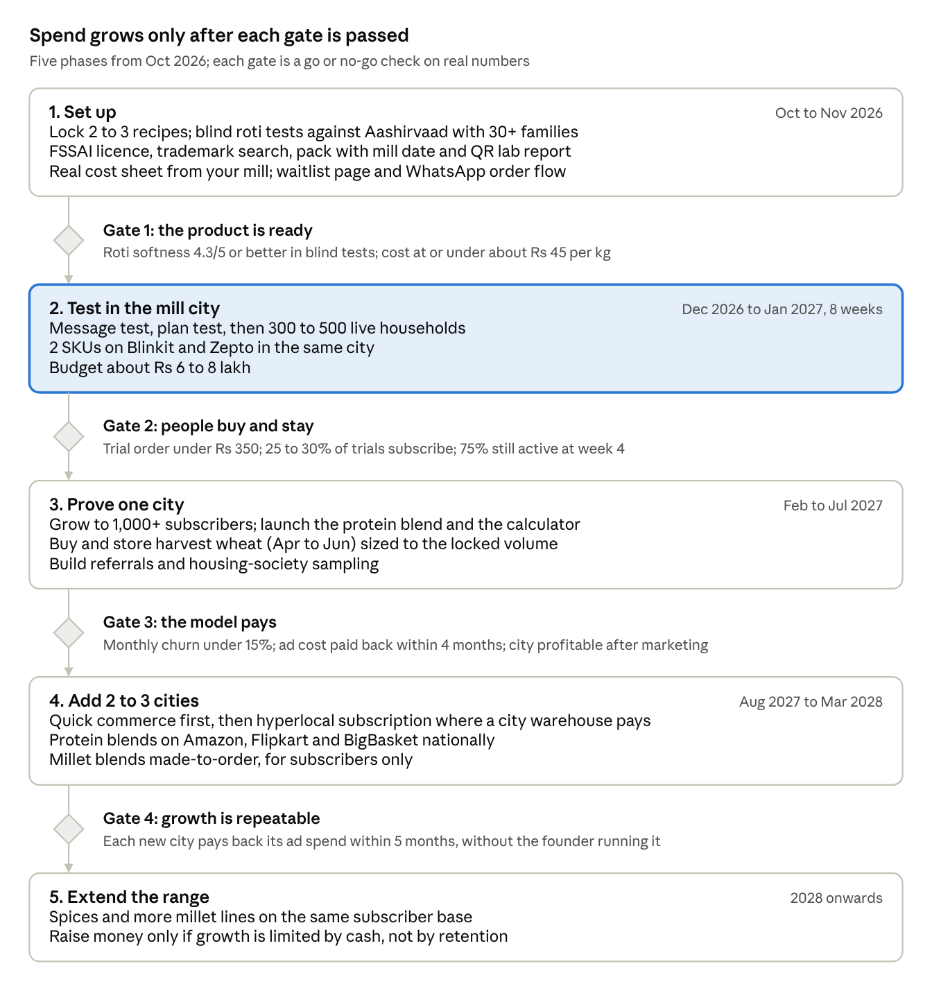

# Atta Brand India: Launch Research & Performance Marketing Plan

Oct 1, 2026 · @Garvit

> Markdown copy of the live doc: https://claude.ai/code/artifact/e0ef8c42-6d48-498f-8a40-7d81e895d6da (the doc is the version to edit and comment on).

## Verdict

The business is viable as a premium, mill-backed atta brand in 4 to 6 North and West Indian metros. It is not viable, in the next 2 years, as a brand that "rules" the atta category on quick commerce. Plan for the first, and earn the right to the second.

What works in your favour:

- **You own the mill.** You control cost, quality, batch size and mill date. Most D2C rivals rent capacity. This is your only hard advantage, so build the brand around it.
- **Wheat is cheap and plentiful right now.** India expects a fourth straight record crop (about 120 million tonnes), government stocks are nearly double the buffer, and the 2027-28 support price rose only Rs 25 to Rs 2,610 per quintal. This is the best window in years to offer a price lock.
- **The premium end is growing fastest.** ITC says its specialty staples (multigrain atta, besan) grew 3x in five years. Packaged atta is growing about 12% a year, against about 3.5% for all wheat flour.

The five blind spots in the current idea:

1. **Your three "new" ideas are already taken.** Aashirvaad launched High Protein atta (Sept 2025) and "Namma Chakki" made-to-order flour (Bengaluru). MILLD (protein atta) reached about 6 lakh households in under a year. Anmasa (custom made-to-order atta) has raised Rs 47 crore. You are not first. You must be better on one thing and cheaper to run.
2. **"Purely performance marketing" is a cost trap for a Rs 300 to Rs 600 staple.** One order rarely pays back the ad cost. Profit only comes from the 3rd to 6th repeat order. Paid ads must be paired with sampling, referrals and content, or CAC will eat the business.
3. **"Organically processed" is not a legal claim.** "Organic" in India needs certified organic grain (NPOP or PGS-India). "Pure" cannot be part of a brand name. "Fresh" is restricted. Your purity story must be rebuilt on things you can prove: mill date, single-origin wheat, no maida, a lab report per batch.
4. **"Modern India has no time" points at the wrong problem.** Buying atta already takes 10 minutes on Blinkit. The real time drains are (a) the chakki ritual: buying wheat, cleaning it, waiting at the mill, and (b) the mental load of deciding what is healthy. Sell relief from those two.
5. **Too many lines at once.** Wheat, millets, protein blends, a calculator, subscriptions and spices is six businesses. Millet flours also go rancid in days, which clashes with warehouse-based quick commerce. Launch with one hero atta and two variants; add lines only after repeat rates prove out.

## Market

Branded atta is a Rs 10,000 to 25,000 crore market growing about 12% a year, but it is still only 10 to 15% of all flour sold. Your real competitor is the neighbourhood chakki, not Aashirvaad.

| Metric | Figure | Source |
| --- | --- | --- |
| All wheat flour, India (2025) | about US$ 8.8 bn (about Rs 75,000 cr), growing 3.5% a year | [IMARC](https://www.imarcgroup.com/india-wheat-flour-market) |
| Packaged atta (2025) | Rs 9,510 cr, forecast Rs 28,640 cr by 2034 (12.6% a year) | [IMARC](https://www.imarcgroup.com/india-packaged-atta-market) |
| Branded atta, other estimates | Rs 15,000 cr implied by Aashirvaad's share; up to Rs 25,000 cr in trade estimates | [Millennium Post](https://www.millenniumpost.in/business/itcs-aashirvaad-atta-now-a-rs-4k-cr-brand-with-28-market-share-288203) |
| Organised share of all flour | 10 to 15% | [Kanvic](https://www.kanvic.com/grey-matter/driving-the-growth-of-branded-flour) |
| Aashirvaad atta | about Rs 4,000 to 4,200 cr, about 28% of branded | [Millennium Post](https://www.millenniumpost.in/business/itcs-aashirvaad-atta-now-a-rs-4k-cr-brand-with-28-market-share-288203) |
| ITC specialty staples (multigrain, besan, etc.) | grew 3x in 5 years; 16% of ITC staples in FY26 (Apr 2025 to Mar 2026) | [Outlook Business](https://www.outlookbusiness.com/corporate/itcs-fmcg-revenue-rises-to-24210-cr-in-fy26-foods-business-crosses-20000-cr) |
| E-commerce share of FMCG, top 8 metros | about 21% (June quarter), quick commerce is 60 to 75% of that | [NielsenIQ via RetailIntel](https://retailintel.in/signal/nielseniq-e-commerce-reaches-21-of-fmcg-sales-in-top-eight-m-499d6c03) |
| Quick commerce order value, FY25 | Rs 64,000 cr; Blinkit about 45 to 50% share | [CIIM](https://www.ciim.in/zepto-vs-blinkit-vs-instamart-market-share-revenue-profit-a-case-study-2024-20265/) |
| Cereal eaten per person per month (2023-24) | rural 9.4 kg, urban 8.0 kg, falling for 30 years | [CEDA Ashoka](https://ceda.ashoka.edu.in/growing-more-eating-less-indias-cereal-consumption-patterns/) |

What this means for you:

- **The estimates disagree by 2.5x.** Treat any "Rs 25,000 crore market" slide with suspicion. For planning, use Aashirvaad's numbers, which are audited.
- **Indians are eating less cereal, but better cereal.** Falling per-person cereal use plus fast growth in multigrain and protein atta means the money is in value per kg, not volume. That supports a premium brand.
- **Demand is regional.** Wheat is over half of cereal eaten in 11 states (North, Central and West India). Launch where rotis are eaten daily: Delhi NCR, Jaipur, Chandigarh, Lucknow, Ahmedabad, Pune, Mumbai, Indore. Bengaluru and Hyderabad work only for migrant and health-focused buyers.
- **Online is now a real share of staples in metros.** About 1 in 5 FMCG rupees in the top 8 metros is spent online, mostly on quick commerce. Outside metros, general trade still dominates.

## Competition

Every angle you named (chakki-fresh, custom blends, protein, millets, organic) already has a funded or giant player. The open gap is narrower: a mid-premium (Rs 70 to 120 per kg) atta that proves freshness and origin on every pack, sold in a few cities with excellent repeat.

| Player | What they sell | Price, Rs/kg | Scale / backing | Threat to you |
| --- | --- | --- | --- | --- |
| [Aashirvaad Shudh Chakki](<https://blinkit.com/prn/aashirvaad-shudh-chakki-whole-wheat-atta-(10-kg)/prid/333324>) (ITC) | Mass whole wheat atta | 41 to 46 (10 kg) | About Rs 4,000 cr brand, 28% share | Sets the price anchor and the "soft roti" benchmark |
| [Aashirvaad High Protein](https://www.zeebiz.com/companies/news-aashirvaad-atta-with-high-protein-soya-gram-oats-launched-by-itc-check-out-share-price-nse-bse-378584) (ITC) | Wheat + 10% soya + chana + oats, about 15 g protein/100 g | 61 to 83 | Launched Sept 2025, metro e-commerce | High: owns "protein atta" at a mass price |
| [Aashirvaad Namma Chakki](https://www.indianretailer.com/news/aashirvaad-introduces-exclusive-range-made-order-flours-under-namma-chakki) (ITC) | Made-to-order Sharbati, Khapli, Lokwan, millet flours | 85 to 159 | D2C in Bengaluru, also BigBasket and Instamart | High: ITC is testing your exact model |
| [Fortune Chakki Fresh](https://www.bigbasket.com/pd/40120175/fortune-chakki-fresh-atta-100-atta-0-maida-10-kg/) (AWL Agri) | Mass atta | 40 to 46 | National distribution | Price pressure only |
| [MILLD](https://indianretailer.com/news/high-protein-atta-brand-milld-grows-rapidly-across-tier-ii-and-tier-iii-india) | High-protein atta | 230 to 250 | About 6 lakh households, 1,700 cities, Rs 12 cr raised, 47% of orders are repeat | High in protein; proves D2C staples can scale |
| [Anmasa](https://inc42.com/buzz/exclusive-former-milkbasket-cofounder-yatish-talvadia-launches-d2c-grocery-brand-anmasa/) | Custom made-to-order atta (you pick the grain mix), 80+ SKUs | Premium | Rs 47 cr raised (Fireside, Blume), Gurugram, 90-min delivery | High in Delhi NCR; already has the "calculator" idea |
| [Two Brothers Organic Farms](https://eng.ruralvoice.in/national/two-brothers-organic-farms-launches-khapli-protein-atta-at-rs-265-per-kg.html) | Certified organic Khapli atta, protein atta | 221 to 425 | About Rs 76 cr sales, strong farmer story | Medium: owns the "roots and tradition" story at the top end |
| [24 Mantra](https://www.bigbasket.com/pd/279853/24-mantra-organic-atta-whole-wheat-1-kg-pouch/) / [Organic Tattva](https://www.bigbasket.com/pd/40009444/organic-tattva-wheat-flour-atta-5-kg-pouch/) | Certified organic atta | 45 to 78 | Wide quick commerce listing | Medium: organic at near-mass prices |
| Local fresh-chakki startups ([Chakki & Co.](https://chakki.co/), [Fresh24Hr](https://www.fresh24hr.in/), [Urban Chakki](https://urbanchakki.in/), [Swastah](https://swastah.in/)) | Milled after order, next-day delivery | Varies | Small, city-level | Low each, but they prove demand for mill-date freshness |
| [Bharat Atta](https://www.outlookbusiness.com/news/government-produced-bharat-atta-to-be-sold-at-subsidised-prices-amid-diwali-demand) (Govt.) | Subsidised atta | about 30 | Mobile vans, co-op stores | Sets the floor in the buyer's mind |

Three takeaways:

- **Protein atta is no longer a white space.** ITC sells about 15 g/100 g at Rs 61 to 83 per kg. You cannot win "protein" on price against ITC, or on extreme protein against MILLD. Win on taste and roti softness at a clear protein level (for example 16 to 18 g/100 g).
- **Made-to-order is proven but small.** ITC limited Namma Chakki to one city. That tells you the logistics are hard at scale. Your mill lets you do a lighter version: "milled within 7 days" for quick commerce, "milled within 48 hours" for subscribers.
- **The middle is thin.** Below Rs 50 is ITC and Adani's game. Above Rs 200 is a tiny niche. Rs 70 to 120 per kg (single-origin Sharbati, Khapli blends, protein blends) is where a new brand can price for margin and still repeat monthly.

## Where you can win

Position the brand as **"your family chakki, without the chakki trip"**: chakki-fresh atta with proof on every pack, delivered on a schedule, at a fixed price. Purity and roots are the feeling; proof is the product.

**Who to sell to first**

- **Core buyer:** urban households in North and West India, age 28 to 45, often both partners working. They grew up on chakki atta, distrust packaged atta (old stock, maida mixing), but no longer have time to buy wheat, clean it and wait at the mill.
- **Second buyer:** fitness-aware 24 to 35 year olds who want more protein without changing what they eat. Reach them with the protein blend, not the plain atta.
- **Not now:** price-led mass buyers (ITC and Adani win there), and rice-first households in the South and East.

**Proof points only a mill owner can offer** (each one must be true before you say it):

1. **Mill date printed large on the front**, and a QR code showing "days since milling". Big brands cannot do this because their stock sits in depots for weeks.
2. **Named origin**, for example "MP Sharbati, Sehore", with the mandi lot on the QR page.
3. **A lab report per batch** behind the QR: moisture, gluten, fibre (proves no maida), pesticide screen.
4. **A roti softness promise:** "If your rotis are not soft, we refund the pack." Softness is the top reason people pick an atta brand, and this costs little because few people claim.
5. **Stone-ground, only if true.** If your mill is a roller mill, do not say "chakki". The claim will be tested.

**Tone and message**

- Hinglish, warm, a little witty. Think "Nani ki chakki, ab app pe", not "premium artisanal flour".
- Show culture through stories, visuals and rituals (the smell of fresh atta, the first roti for the cow). Avoid putting "traditional", "pure", "natural" or "fresh" in the brand name: FSSAI bars "pure" in brand names and makes the others carry a disclaimer (see Rules).
- One message per ad. Freshness for the plain atta. Protein for the blend. Price lock for the subscription. Do not stack all three in one creative.

**What is genuinely new in your plan:** combining mill-date proof, a city subscription with a price lock, and presence on quick commerce. ITC's Namma Chakki has the first, Anmasa the first two in one city, MILLD the third. Nobody has all three across several North Indian cities yet. That window is probably 12 to 18 months.

## Channels

Use quick commerce for discovery and your own hyperlocal subscription for profit. National D2C by courier does not work for plain atta: shipping a 5 kg bag costs Rs 160 to 400, about as much as the atta itself.

| Channel | How it works for a new brand | What it costs you | Role |
| --- | --- | --- | --- |
| Quick commerce (Blinkit, Zepto, Instamart) | Blinkit buys from you as a retailer. New brands usually start on sale-or-return, with about Rs 25,000 per SKU per state paid upfront and returned as ad credit. Needs GST, FSSAI licence, GS1 barcodes, and each platform warehouse added to your GST. Takes 7 to 15 days. | Platform margin about 18 to 25%, plus 8 to 15% of sales on ads in year 1. Up to about 35% in total. | Discovery and trust in your launch cities |
| Own hyperlocal subscription (app/WhatsApp + local delivery) | You deliver from the mill or a small city warehouse on fixed routes, Country Delight style. | About Rs 30 to 50 per drop on batched routes (estimate). | Profit, retention, price-lock offer, data |
| Amazon, Flipkart, BigBasket | Grocery runs on their own inventory models; heavy items carry high fees. | Similar to quick commerce, slower to build rank. | Later, for high-value blends (Rs 150+ per kg) sold nationally |
| National D2C by courier | Ship from mill to any pin code. | Rs 160 to 400 per 5 kg parcel ([Shiprocket](https://www.shiprocket.in/blog/delhivery-courier-charges/)) | Only for protein blends and small packs, never plain atta |
| Kirana and modern trade | Distributors, retailer margins, credit. | High working capital. | Not in year 1 |

How to win on quick commerce without outspending ITC:

- **Do not fight for the word "atta".** Sponsored slots on generic searches go to the biggest bidder. Target cheaper, high-intent searches you can own: "sharbati atta", "khapli atta", "protein atta", "chakki atta fresh", "multigrain atta".
- **Velocity keeps you listed.** Dark stores have limited shelf space and drop slow SKUs. Launch with 2 to 3 SKUs in 1 to 2 cities, not 10 SKUs nationally.
- **Freshness clashes with warehouses.** Stock can sit 2 to 6 weeks between your mill and the customer. Send small, frequent purchase orders and print the mill date large. Keep millet flours off quick commerce until you can stabilise them (see Protein blends).
- **Ratings matter more than ads after month 3.** Put a QR "rate your rotis" card in every pack to push reviews.

Sources: [Blinkit onboarding guide](https://confetti.design/blog/can-first-time-brands-sell-on-blinkit), [platform fees](https://ecomsarthi.com/blog/blinkit-vs-zepto-vs-instamart), [quick commerce ad costs](https://inc42.com/features/quick-commerce-turns-on-the-ad-tap/). Fee figures come from seller-agency guides, not the platforms; confirm in your own vendor terms.

## Unit economics

A 10 kg-a-month subscriber in your own city earns about Rs 317 a month after delivery. A quick commerce order earns about Rs 62. A courier order loses money. The business works only if most profit comes from local subscribers who stay 8+ months.

These are my estimates for a mid-premium MP Sharbati atta at Rs 90 per kg MRP. Replace them with your mill's real numbers.

**Cost to make 1 kg** (estimate): wheat Rs 33 landed (Sharbati traded at about Rs 26 to 33 per kg in MP mandis; [Sehore prices](https://www.mandiprices.com/wheat-price/madhya-pradesh/sehore/mp-sharbati.html), [Indore Lokwan](https://www.mandiprices.com/wheat-price/madhya-pradesh/indore/lokwan.html)) x 1.04 for cleaning loss, + Rs 2.5 milling, + Rs 4 packaging, + Rs 1 lab testing = **about Rs 42 per kg, Rs 209 per 5 kg bag**.

| Per order, Rs | Quick commerce (5 kg) | Own subscription (10 kg/month) | Courier D2C (5 kg) |
| --- | --- | --- | --- |
| Price the customer pays | 430 | 850 (2 x 425, price-locked) | 450 |
| Revenue after 5% GST | 410 | 810 | 429 |
| Platform margin (22%) | -90 | 0 | 0 |
| Product cost | -209 | -418 | -209 |
| Delivery | -8 (freight to platform) | -40 (one batched drop) | -160 to -400 |
| Ads on platform (10%) | -41 | 0 | 0 |
| Payment gateway and support (about 4%) | 0 | -34 | -9 |
| **Contribution per order** | **about 62 (14%)** | **about 317 (37%)** | **-190 to +50** |

What a subscriber is worth, with Rs 1,000 to acquire one (see Performance marketing):

| Household buys per month | Monthly churn | Months stayed (average) | Lifetime contribution, Rs | Return on Rs 1,000 CAC | Payback |
| --- | --- | --- | --- | --- | --- |
| 10 kg | 10% | 10 | 3,170 | 3.2x | 3.2 months |
| 10 kg | 15% | 6.7 | 2,115 | 2.1x | 3.2 months |
| 10 kg | 20% | 5 | 1,590 | 1.6x | 3.2 months |
| 5 kg | 10% | 10 | 1,390 | 1.4x | 7.2 months |
| 5 kg | 15% | 6.7 | 925 | 0.9x (loss) | 7.2 months |

What this tells you:

- **Target families, not singles.** A 5 kg-a-month household does not pay back at normal churn. Price the plans so 10 kg+ is the obvious choice (for example, free delivery only from 10 kg).
- **Monthly churn must stay under about 15%.** Above that, paid acquisition loses money even for big households. This is the single most important number to measure in the test.
- **Quick commerce is a marketing cost, not a profit centre,** in year 1. Treat its 14% contribution as "paid sampling that covers itself".
- **The protein blend changes the maths.** At Rs 150 to 250 per kg, a 2 kg pack carries 3 to 4x the margin per kilo, so it can survive courier shipping and national marketplaces. Plain atta cannot.

## Performance marketing

Run the brand "performance-led", not "performance-only": about 75% of spend on measurable paid channels, 25% on trust builders (sampling, referrals, creators) that are also tracked with codes. Paid ads find buyers; for a food staple, trust is what keeps them past month 3, and month 3 is where your profit starts.

**Why pure performance is risky here**

- Meta conversion ads in India cost about Rs 80 to 150 per 1,000 views, and 30 to 50% more in Oct to Nov festive season ([Nurdd benchmarks](https://www.nurdd.club/blogs/paid-media-benchmarks-for-indian-d2c-brands-2026-cpm-cpc-ctr-and-roas-by-category)). At a 1.2% click rate and 3% order rate, one first order costs about Rs 330. If 30% of trials subscribe, one subscriber costs about Rs 1,100.
- People switch staples on trust (a neighbour, a mother, a doctor), not on an ad. Ads alone bring discount hunters who leave in month 2.
- India has no reliable cross-app tracking. You will need city-level holdouts and unique codes to know what really works.

**Channel mix for the first 6 months**

| Channel | Share of budget | Job | Target |
| --- | --- | --- | --- |
| Meta: Instagram Reels, Facebook, Click-to-WhatsApp | 40% | Find new households in launch-city pin codes | Cost per trial order under Rs 350 |
| Quick commerce ads (sponsored search, category banners) | 25% | Catch people already searching | Return of 2.5x+ on ad spend; top 3 slot on 5 long-tail searches |
| Creators, run as ads from their handles | 15% | Borrow trust: home cooks, city moms, dietitians | Cost per trial within 20% of Meta |
| Referral + housing society sampling | 10% | Neighbour-to-neighbour trust | 1 in 4 new subscribers from referral by month 6 |
| Google Search, YouTube Shorts | 10% | High-intent searches ("fresh chakki atta delivery", "protein atta") | Cost per subscriber under Rs 900 |

**Rules for the creative engine**

- Make 15 to 20 new ads a month. Ads tire in 2 to 3 weeks at small budgets.
- Strong formats for this category: the mill-date reveal ("milled 3 days ago, look"), the roti softness test, a grandmother tasting the roti, the 15-second price-lock explainer, a visit to the mill.
- Never name or mock a rival brand. Comparative ads that run down a competitor draw ASCI complaints and legal notices.
- Any creator talking protein, nutrients or health needs a stated qualification (dietitian, doctor) under ASCI's 2023 rules ([ASCI](https://www.ascionline.in/wp-content/uploads/2023/08/Health-and-Finance-Guidelines-Update-Press-Release.pdf)).
- Test Click-to-WhatsApp against a landing page early. For groceries in India, a WhatsApp chat often converts better than a web checkout.

**Numbers to watch every week:** cost per trial order, trial-to-subscription rate, month-2 retention, monthly churn, contribution per subscriber, payback months. If payback stays above 4 months for 6 straight weeks, cut paid spend and fix retention first.

## Social media test plan

Spend about Rs 6 to 8 lakh over 8 weeks in one city to answer four questions before you build anything big: which message sells, which plan people pay for, what a subscriber really costs, and whether they reorder.

**The four questions**

1. Which message makes people act: mill-date freshness, no-maida purity, roots and nostalgia, protein, or the price lock?
2. Will people subscribe, and will any of them prepay for 6 or 12 months?
3. What does one subscriber cost in a real city, with real delivery?
4. Do they reorder after the first bag? (Only real product answers this.)

**The 8 weeks, in order**

1. **Weeks 1 to 3: message test, before product ships (about Rs 1.5 lakh).** Meta ads in your mill's city only. 5 message angles x 3 creatives = 15 ads. Send clicks to a simple page: join the waitlist, or reserve a launch price with a fully refundable Rs 99. Say clearly on the page that you launch on a stated date and the Rs 99 is refundable. Hiding that would be a dark pattern.
2. **Weeks 3 to 5: plan and price test (about Rs 1 lakh).** Show each lead one of three plans at random: (a) pay monthly, price locked 6 months, cancel any time; (b) prepay 6 months, about 8% off; (c) prepay 12 months, about 12% off. Take real payments through UPI AutoPay or a payment-gateway subscription.
3. **Weeks 5 to 8: live soft launch (about Rs 3 to 4 lakh including trial subsidies).** Deliver to 300 to 500 households in 3 to 5 pin-code clusters. Offer a 2 kg trial at about Rs 99, then the subscription. Call every 10th customer in week 2 and week 4.
4. **Weeks 4 to 8, in parallel: quick commerce listing.** List 2 SKUs on Blinkit and Zepto in the same city (7 to 15 days to onboard, about Rs 25,000 per SKU returned as ad credit). Track units sold per dark store per day.
5. **All 8 weeks: organic content.** Post 4 to 5 Reels and Shorts a week from the mill. Reels with high saves and shares become paid ads.

**Kill or scale numbers** (my starting thresholds; tighten after week 3)

| Metric | Kill or rework below | Scale above |
| --- | --- | --- |
| Link click rate on Meta, per angle | 0.8% | 1.5% |
| Cost per waitlist sign-up | over Rs 80 | under Rs 40 |
| Sign-ups who pay the refundable Rs 99 | 5% | 15% |
| Cost per trial order (live) | over Rs 500 | under Rs 300 |
| Trial to subscription | 15% | 30% |
| Subscribers choosing a prepaid plan | 5% (drop prepaid, keep monthly lock) | 20% (make prepaid the hero offer) |
| Still subscribed at week 4 | 50% | 75% |
| Roti softness rating, 1 to 5 | 3.8 | 4.3 |

Read the results in this order: retention first, then trial-to-subscription, then cost per trial. A cheap ad that brings customers who leave is worth nothing.

## Subscription and price lock

Lead with a monthly plan that locks the price for 6 months and can be cancelled any time. Treat 6- and 12-month prepaid plans as tests, not the main offer. The price lock is affordable: even a 2022-style 30% jump in wheat would cut a 10 kg subscriber's monthly profit by about a third (Rs 317 to about Rs 214), not to zero.

**Plan options**

| Plan | Customer gets | You risk | Recommendation |
| --- | --- | --- | --- |
| Monthly, price locked 6 months | Same price for 6 months; pause, skip or cancel any time; free delivery from 10 kg | 6 months of wheat price moves | Lead offer |
| 6 months prepaid | About 8% off, paid upfront | Refunds if they cancel; price risk | Test |
| 12 months prepaid | About 12% off, paid upfront | Full year of price risk; legal limit at 365 days | Test with a small batch only |
| "Pay the lower of locked or market price" | No downside for the buyer | You lose if prices fall, which is likely this year | Do not offer |

**The wheat price risk, and how to carry it**

- **You cannot hedge on an exchange.** SEBI has suspended wheat futures since 2021, now extended to 31 March 2027 ([The Week](https://www.theweek.in/wire-updates/business/2026/03/27/sebi-extends-suspension-on-trading-in-7-agri-commodity-derivatives-till-mar-2027.html)).
- **Swings are real.** After the 2022 heatwave, average retail atta rose from about Rs 28.8 to about Rs 38 per kg in under two years, roughly +32% ([Tribune](https://www.tribuneindia.com/news/business/with-average-prices-of-atta-rising-to-rs-38-per-kg-govt-to-sell-30-lakh-tonnes-of-wheat-from-buffer-stock-to-curb-hike-473665/amp)).
- **Right now the odds favour you.** USDA forecasts a fourth record crop (about 120 million tonnes); government stocks were 513 lakh tonnes on 28 May 2026, against a buffer norm of about 276 ([USDA](https://www.fas.usda.gov/data/gain/2026/04/india-grain-and-feed-annual)). The 2027-28 support price rose only Rs 25 to Rs 2,610 per quintal ([Rural Voice](https://eng.ruralvoice.in/latest-news/wheat-msp-hiked-by-rs-25-to-rs-2610-for-2027-28-rabi-season-less-than-1-pc-increase.html)).
- **Hedge physically.** Buy and store the wheat for your locked volume at harvest (April to June). Example: 1,000 subscribers x 10 kg x 12 months = 120 tonnes, about Rs 40 lakh of wheat at Rs 33 per kg. Prepaid money funds part of this. Store in a registered warehouse so you can borrow against the stock if needed.
- **Cap the lock** at about 20 kg per household per month, one address per plan, so local shops cannot buy your stock at a fixed price to resell.

**Legal limits to design around**

- **365-day rule.** A customer advance not used against goods within 365 days becomes a "deposit" under the Companies Act. Never sell a prepaid plan longer than 12 months, and deliver monthly against it ([Taxmann](https://www.taxmann.com/post/blog/reporting-exempted-deposits-under-companies-act-deposit-rules/)).
- **No subscription traps.** India's 2023 dark-pattern guidelines ban hard-to-cancel subscriptions. Give one-tap cancel, a reminder before each renewal, and pro-rata refunds on prepaid plans ([Trilegal summary](https://trilegal.com/wp-content/uploads/2023/12/Guidelines-for-Prevention-and-Regulation-of-Dark-Patterns-2023.pdf)).
- **No fake scarcity.** "Only 500 slots" is fine only if it is true. False urgency is also a banned dark pattern.
- **AutoPay works for you.** After one-time setup, recurring debits up to Rs 15,000 per transaction run without an OTP ([Razorpay](https://razorpay.com/blog/upi-autopay-vs-card-e-mandates/)). A monthly atta bill sits far below that.

**Expect low prepaid uptake.** Indian grocery subscriptions (milk, daily needs) run on small prepaid wallets, not 6 to 12 months upfront. If under 5% of subscribers prepay in the test, keep the monthly lock as the offer and drop prepaid.

## Protein blends and the nutrition calculator

Build the calculator, but have it recommend from 6 to 8 lab-tested blends, not mix a new recipe for every customer. Custom one-off blends each need their own tested nutrition label, allergen warning and roti test, which a single mill cannot do at scale.

**The protein maths** (protein per 100 g from the ICMR-NIN Indian Food Composition Tables 2017, as summarised [here](https://organicmandya.com/blogs/news/ragi-nutritional-value) and [here](https://myproteincalc.com/learn/foods/chana-protein); one medium roti = about 30 g atta):

| Blend | Recipe | Protein per 100 g | Per roti | 4 rotis vs a 65 kg adult's daily need (54 g) |
| --- | --- | --- | --- | --- |
| Plain whole wheat | 100% wheat | about 12 g | 3.6 g | 27% |
| Everyday multigrain | 70% wheat, 10% jowar, 5% bajra, 5% ragi, 10% oats | about 11.7 g | 3.5 g | 26% |
| Daily protein | 75% wheat, 15% chana dal, 10% soy | about 16.2 g | 4.9 g | 36% |
| High protein (needs taste tests) | 65% wheat, 20% chana dal, 15% soy | about 18.1 g | 5.4 g | 40% |

Daily need uses ICMR-NIN's 0.83 g of protein per kg of body weight: about 54 g for a 65 kg man and 46 g for a 55 kg woman ([summary](https://blog.unboxhealth.in/how-much-protein-per-day-india/)).

**What the numbers say**

- **Multigrain does not mean more protein.** Millets carry less protein than wheat. Multigrain sells on fibre and variety, not protein. This is also a strong, honest piece of content.
- **Protein comes from pulses.** Chana and soy lift a roti from 3.6 g to about 5 g. That is the product.
- **Rotis set the ceiling.** Non-wheat flour dilutes gluten, so dough tears and rotis turn hard. Studies find chapatis stay acceptable at about 10% soy and about 20% chickpea flour ([soy study](https://www.researchgate.net/publication/238045115_Nutritional_quality_and_safety_of_wheat-soy_composite_flour_chapattis), [composite flour study](https://www.sciencedirect.com/science/article/pii/S2949824424000958)). Keep total non-wheat under about 30 to 35% and test softness on every recipe.
- **Millet flours go rancid fast.** Untreated bajra flour can turn rancid within about 10 days of milling; whole wheat atta lasts about 1 to 3 months before flavour drops ([study](https://www.ncbi.nlm.nih.gov/pmc/articles/PMC12588842/)). Either heat-treat millet grain before milling, or sell millet blends only made-to-order to subscribers with a short best-before date.

**How the calculator should work**

1. Inputs: age, sex, weight, activity level, veg or non-veg, rotis per day, family size, and a few protein foods eaten daily (dal, paneer, curd, milk, eggs).
2. Output: the person's daily protein target, how much their rotis give now, the gap, the recommended blend, and the kilos the family needs each month.
3. The last screen is a subscription pre-filled with that blend and quantity. The calculator is a sales tool first and a nutrition tool second.
4. Use it in ads as a hook: "How much protein are your rotis really giving you?" It also collects WhatsApp opt-ins.

**Claim limits for this line**

- FSSAI's 2018 claims rules allow "source of protein" and "high protein" only above set shares of the daily reference value per 100 g ([FSSAI compendium](https://www.fssai.gov.in/upload/uploadfiles/files/Compendium_Advertising_Claims_Regulations_04_10_2022.pdf)). Have a food-regulatory consultant confirm the threshold for each blend from lab results.
- No disease claims: do not say the blend manages diabetes, cures anything, or causes weight loss. Say "helps you meet your daily protein from everyday rotis".
- Label soy and gluten as allergens on every protein SKU.

## Rules you must follow

Your brand story (purity, tradition, freshness, organic, protein) uses almost every word FSSAI regulates. Get a food-regulatory consultant to sign off the name, pack and first 20 ads before launch; it costs far less than a recall or a notice.

| Area | The rule | What it means for you | Source |
| --- | --- | --- | --- |
| "Organic" | Only grain certified under NPOP or PGS-India can be called organic, with the Jaivik Bharat logo. Small farmers selling direct to consumers are exempt. | "Organically processed" is not a recognised claim. Either buy certified organic wheat for an organic line, or drop the word. | [FSSAI Organic Regulations summary](https://www.indialaw.in/blog/civil/transparency-organic-foods-regulation/) |
| "Pure" | Cannot be part of any brand or fancy name. | Do not name the brand "Pure ...". "100% whole wheat, 0% maida" is a factual claim you can make. | [FSSAI claims rules](https://foodsafetyworks.com/insights/conditions-behind-the-conditional-claims/) |
| "Fresh" | Only for foods not processed beyond washing, peeling, chilling or cutting. Milling is processing. | Say "milled on 12 Oct" (a fact), not "fresh atta". If "fresh" is in a brand name, a 3 mm disclaimer is required. | [FSSAI claims rules](https://foodsafetyworks.com/insights/conditions-behind-the-conditional-claims/) |
| "Natural", "traditional", "authentic" | Allowed only under the conditions in Schedule V of the 2018 claims rules; in a brand name they need the same disclaimer. | Show tradition through stories and visuals; keep the regulated words off the front of pack unless cleared. | [FSSAI compendium](https://www.fssai.gov.in/upload/uploadfiles/files/Compendium_Advertising_Claims_Regulations_04_10_2022.pdf) |
| Protein claims | "Source of" and "high" protein have minimum levels per 100 g. | Lab-test each blend; print the grams per 100 g and per roti. | [FSSAI compendium](https://www.fssai.gov.in/upload/uploadfiles/files/Compendium_Advertising_Claims_Regulations_04_10_2022.pdf) |
| GST | Packaged and labelled atta pays 5%; loose atta pays 0%. Unchanged by the Sept 2025 GST reform. | The local chakki starts with a 5% price advantage. Your proof must justify it. | [Busy GST guide](https://busy.in/gst-rates/food/) |
| Packaging (Legal Metrology) | MRP, net weight, price per kg, packer address, customer-care contact and month of packing on every pack. | Standard; design the pack around it. | Legal Metrology (Packaged Commodities) Rules |
| Influencer ads | Label every paid post. Creators giving health or nutrition advice must show their qualification upfront. | Use dietitians for protein content; home cooks for taste and softness. | [ASCI](https://www.ascionline.in/wp-content/uploads/2023/08/Health-and-Finance-Guidelines-Update-Press-Release.pdf) |
| Subscriptions | No hard-to-cancel plans, fake urgency or hidden auto-debits. | One-tap cancel, renewal reminders, pro-rata refunds. | [Dark-pattern guidelines](https://trilegal.com/wp-content/uploads/2023/12/Guidelines-for-Prevention-and-Regulation-of-Dark-Patterns-2023.pdf) |
| Prepaid money | Customer advances must be used against goods within 365 days, or they count as deposits. | Maximum prepaid term: 12 months. | [Taxmann](https://www.taxmann.com/post/blog/reporting-exempted-deposits-under-companies-act-deposit-rules/) |

Also before launch: an FSSAI manufacturing licence covering each product type, a trademark search in class 30 (flour and cereal products) for the brand name, and GS1 barcodes for every SKU.

## Roadmap

Five phases over about 18 months. Money moves to the next phase only when the gate's numbers are hit; if a gate fails, you fix that phase instead of spending more.

The 8-week test (phase 2, highlighted) decides everything after it. The harvest wheat purchase in April to June 2027 falls inside phase 3, so you will know how many subscribers you are locking prices for before you buy.

## Open questions for you

The answers to these change the plan more than any market report.

- [ ] **Where is the mill, and what kind is it?** City decides the launch market (hyperlocal delivery only works near the mill). Stone chakki or roller mill decides whether you can say "chakki".
- [ ] **What are your real costs?** Landed price per variety (Sharbati, Lokwan, Khapli), milling cost per kg, packaging quote. My Rs 42 per kg estimate could be off by Rs 5 either way, which moves contribution by about 12%.
- [ ] **What does the mill do today?** If it already sells B2B (bakeries, kiranas, institutions), keep that running. The brand will use under 1 tonne a day for its first year; it cannot carry the mill's fixed costs.
- [ ] **How much money is behind this, and for how long?** MILLD raised Rs 12 crore and Anmasa Rs 47 crore. Decide now whether you will raise or grow on profit, because it sets how fast you can spend on ads.
- [ ] **Who runs delivery in the launch city?** Own riders, a local partner, or a milk-delivery network you can share routes with.
- [ ] **Do you have access to certified organic wheat?** If not, drop "organic" from the plan for year 1.
- [ ] **Who is the face of the brand?** A founder or a miller's family on camera builds trust faster and cheaper than paid creators.

## Sources

A note on method: figures were gathered through web search summaries. This session's network settings blocked opening most pages directly, so treat every number as a lead to verify, not a fact. The market-size figures in particular disagree with each other. Cost and CAC figures marked "estimate" are my working assumptions.

**Market and players**

- [IMARC: India wheat flour market](https://www.imarcgroup.com/india-wheat-flour-market)
- [IMARC: India packaged atta market](https://www.imarcgroup.com/india-packaged-atta-market)
- [Millennium Post: Aashirvaad a Rs 4,000 cr brand, 28% share](https://www.millenniumpost.in/business/itcs-aashirvaad-atta-now-a-rs-4k-cr-brand-with-28-market-share-288203)
- [Outlook Business: ITC FMCG FY26](https://www.outlookbusiness.com/corporate/itcs-fmcg-revenue-rises-to-24210-cr-in-fy26-foods-business-crosses-20000-cr)
- [Kanvic: growth of branded flour](https://www.kanvic.com/grey-matter/driving-the-growth-of-branded-flour)
- [CEDA Ashoka: cereal consumption](https://ceda.ashoka.edu.in/growing-more-eating-less-indias-cereal-consumption-patterns/)
- [Zee Business: Aashirvaad High Protein atta](https://www.zeebiz.com/companies/news-aashirvaad-atta-with-high-protein-soya-gram-oats-launched-by-itc-check-out-share-price-nse-bse-378584)
- [Indian Retailer: Aashirvaad Namma Chakki](https://www.indianretailer.com/news/aashirvaad-introduces-exclusive-range-made-order-flours-under-namma-chakki)
- [Indian Retailer: MILLD growth](https://indianretailer.com/news/high-protein-atta-brand-milld-grows-rapidly-across-tier-ii-and-tier-iii-india)
- [Inc42: Anmasa launch](https://inc42.com/buzz/exclusive-former-milkbasket-cofounder-yatish-talvadia-launches-d2c-grocery-brand-anmasa/)
- [Rural Voice: Two Brothers protein atta](https://eng.ruralvoice.in/national/two-brothers-organic-farms-launches-khapli-protein-atta-at-rs-265-per-kg.html)
- [Blinkit: Aashirvaad Shudh Chakki 10 kg](<https://blinkit.com/prn/aashirvaad-shudh-chakki-whole-wheat-atta-(10-kg)/prid/333324>)
- [BigBasket: Fortune Chakki Fresh 10 kg](https://www.bigbasket.com/pd/40120175/fortune-chakki-fresh-atta-100-atta-0-maida-10-kg/)
- [Outlook Business: Bharat Atta](https://www.outlookbusiness.com/news/government-produced-bharat-atta-to-be-sold-at-subsidised-prices-amid-diwali-demand)

**Channels and marketing**

- [NielsenIQ via RetailIntel: e-commerce 21% of metro FMCG](https://retailintel.in/signal/nielseniq-e-commerce-reaches-21-of-fmcg-sales-in-top-eight-m-499d6c03)
- [CIIM: quick commerce market shares](https://www.ciim.in/zepto-vs-blinkit-vs-instamart-market-share-revenue-profit-a-case-study-2024-20265/)
- [Confetti: onboarding on Blinkit](https://confetti.design/blog/can-first-time-brands-sell-on-blinkit)
- [Ecomsarthi: Blinkit vs Zepto vs Instamart fees](https://ecomsarthi.com/blog/blinkit-vs-zepto-vs-instamart)
- [Inc42: quick commerce ad spend](https://inc42.com/features/quick-commerce-turns-on-the-ad-tap/)
- [Shiprocket: Delhivery courier charges](https://www.shiprocket.in/blog/delhivery-courier-charges/)
- [Nurdd: Indian D2C ad benchmarks 2026](https://www.nurdd.club/blogs/paid-media-benchmarks-for-indian-d2c-brands-2026-cpm-cpc-ctr-and-roas-by-category)

**Wheat, prices and payments**

- [Rural Voice: wheat MSP 2027-28 at Rs 2,610](https://eng.ruralvoice.in/latest-news/wheat-msp-hiked-by-rs-25-to-rs-2610-for-2027-28-rabi-season-less-than-1-pc-increase.html)
- [USDA FAS: India Grain and Feed Annual 2026](https://www.fas.usda.gov/data/gain/2026/04/india-grain-and-feed-annual)
- [The Week: SEBI extends agri futures suspension to Mar 2027](https://www.theweek.in/wire-updates/business/2026/03/27/sebi-extends-suspension-on-trading-in-7-agri-commodity-derivatives-till-mar-2027.html)
- [Tribune: atta prices rise to Rs 38 per kg](https://www.tribuneindia.com/news/business/with-average-prices-of-atta-rising-to-rs-38-per-kg-govt-to-sell-30-lakh-tonnes-of-wheat-from-buffer-stock-to-curb-hike-473665/amp)
- [Mandiprices: Sehore MP Sharbati](https://www.mandiprices.com/wheat-price/madhya-pradesh/sehore/mp-sharbati.html)
- [Mandiprices: Indore Lokwan](https://www.mandiprices.com/wheat-price/madhya-pradesh/indore/lokwan.html)
- [Razorpay: UPI AutoPay vs card e-mandates](https://razorpay.com/blog/upi-autopay-vs-card-e-mandates/)

**Rules and nutrition**

- [FSSAI Advertising and Claims Regulations compendium](https://www.fssai.gov.in/upload/uploadfiles/files/Compendium_Advertising_Claims_Regulations_04_10_2022.pdf)
- [Food Safety Works: conditional claims (pure, fresh, natural)](https://foodsafetyworks.com/insights/conditions-behind-the-conditional-claims/)
- [IndiaLaw: FSSAI organic regulations](https://www.indialaw.in/blog/civil/transparency-organic-foods-regulation/)
- [Busy: GST on food items 2026](https://busy.in/gst-rates/food/)
- [ASCI: health and finance influencer guidelines](https://www.ascionline.in/wp-content/uploads/2023/08/Health-and-Finance-Guidelines-Update-Press-Release.pdf)
- [Trilegal: dark patterns guidelines 2023](https://trilegal.com/wp-content/uploads/2023/12/Guidelines-for-Prevention-and-Regulation-of-Dark-Patterns-2023.pdf)
- [Taxmann: exempted deposits, 365-day rule](https://www.taxmann.com/post/blog/reporting-exempted-deposits-under-companies-act-deposit-rules/)
- [Unbox Health: ICMR protein requirement](https://blog.unboxhealth.in/how-much-protein-per-day-india/)
- [ResearchGate: wheat-soy composite chapattis](https://www.researchgate.net/publication/238045115_Nutritional_quality_and_safety_of_wheat-soy_composite_flour_chapattis)
- [ScienceDirect: composite flour chapatti acceptability](https://www.sciencedirect.com/science/article/pii/S2949824424000958)
- [PMC: rancidity in pearl millet flour](https://www.ncbi.nlm.nih.gov/pmc/articles/PMC12588842/)
